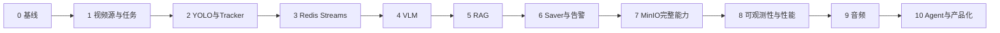

# AI视频分析系统总实施路线图

> **For agentic workers:** REQUIRED SUB-SKILL: Use superpowers:subagent-driven-development (recommended) or superpowers:executing-plans to implement this plan task-by-task. Steps use checkbox (`- [ ]`) syntax for tracking.

**Goal:** 在单机笔记本上逐步建成可演示、可测试、可追溯的YOLO + VLM + RAG多模态视频分析系统。

**Architecture:** 管理面由Flask、MySQL和Web页面组成；媒体面由MediaMTX、Capture Worker和Inference Worker组成；异步AI链路使用Redis Streams连接Event Producer、VLM Consumer与Saver。MySQL保存结构化事实，MinIO保存证据对象，Chroma保存规则向量，SSE向页面推送状态和告警。

**Tech Stack:** Python 3.10+、Flask、SQLAlchemy、MySQL 8.4、Redis 7、MinIO、MediaMTX、FFmpeg/OpenCV、Ultralytics YOLO、Chroma、OpenAI兼容VLM API、Prometheus、structlog、pytest。

## Global Constraints

- 主开发机为RTX 4050 6GB笔记本；GPU恢复前使用CPU与`YOLOv8n`联调。
- 不引入Kafka、Celery、Kubernetes、Milvus等当前规模不需要的重型框架。
- Redis只传小型JSON元数据，不传Base64图片、MP4或音频二进制。
- MySQL只保存MinIO的`bucket/object_key`和校验信息，不持久化Presigned URL。
- Web请求进程不执行长期拉流、YOLO或VLM推理。
- 无人工标注集时不宣称Precision、Recall或mAP，只报告工程性能与定性结果。
- 所有核心功能使用TDD；阶段验收至少覆盖正常、异常、边界、攻击和并发场景。
- 每阶段必须更新`docs/模块开发详解.md`、`docs/项目知识手册.md`和对应测试报告。
- 不保存或展示模型隐藏思维链，只保存结构化结论、证据与必要的原始响应摘要。

---

## 1. 依据与当前基线

- 上位设计：[`../specs/2026-07-18-参考系统选择性对齐设计.md`](../specs/2026-07-18-参考系统选择性对齐设计.md)。
- 当前自动化基线：`66 passed, 12 warnings`。
- 已具备：四个Docker服务、Flask骨架、基础ORM/API、Redis List原型、MinIO基础客户端、MediaMTX基础链路、YOLO CPU基准、日志与Prometheus基础指标。
- 尚未具备：独立视频源、TaskRun、Worker链路、Tracker、Redis Streams可靠消费、VLM、真实RAG、Saver闭环、音频、鉴权与生产安全。

## 2. 最终数据流

```text
摄像头/视频文件
  -> MediaMTX
  -> Capture Worker
  -> Inference Worker（集中加载YOLO）
  -> Event Producer
  -> Redis candidate Stream
  -> VLM Consumer + Chroma RAG
  -> Redis result Stream
  -> Saver
  -> MySQL + MinIO + SSE
```

管理命令走独立控制流：

```text
Web/API -> MySQL任务状态 + Redis控制消息 -> Worker -> TaskRun心跳/状态
```

## 3. 阶段路线图

| 阶段 | 交付目标 | 核心输入 | 核心输出 | 门禁 |
|---|---|---|---|---|
| 0 基线固化 | 固定基础设施、测试和文档事实 | 当前仓库 | 可重复的66项测试基线 | 已完成 |
| 1 视频源与任务模型 | 独立管理媒体源、任务配置和每次运行 | Flask/MySQL/MediaMTX | `VideoSource`、`TaskRun`、状态机、CRUD/探测API | 新旧API兼容，迁移可回滚 |
| 2 集中式YOLO与Tracker | 多源公平调度、集中推理、轨迹输出 | 视频帧、YOLO基准 | Capture/Inference Worker、轨迹消息 | CPU可跑通，积压丢旧帧 |
| 3 Redis可靠事件链路 | 候选事件可靠异步传递 | 轨迹与触发策略 | Streams、Consumer Group、ACK、重试、DLQ | 崩溃恢复且不重复落库 |
| 4 VLM结构化分析 | 多帧行为理解与端点治理 | candidate事件 | Schema校验后的VLM结果 | 超时、限流、熔断、降级可测 |
| 5 RAG规则知识库 | 规则入库、检索、版本和Prompt注入 | PDF/Markdown规则 | Chroma集合与可追溯规则版本 | 有检索评测，空结果可降级 |
| 6 Saver与告警闭环 | 事件、告警、证据、人工处置闭环 | result事件、环形缓冲 | MySQL记录、MinIO证据、SSE通知 | `event_id`幂等，状态审计完整 |
| 7 MinIO完整能力 | 大文件、删除、保留和一致性修复 | 证据及离线视频 | Multipart、批删、Cleaner、完整性校验 | 中断续传与孤儿扫描通过 |
| 8 可观测性与性能 | 全链路指标、压测与推理优化 | 各Worker埋点 | trace_id、阶段耗时、容量基线 | P50/P95/P99和瓶颈可解释 |
| 9 音频模态 | 音频初筛与VLM复核 | 流媒体音轨 | AudioEvent与多模态关联 | 无音频流时不影响视频链路 |
| 10 Agent与产品化 | 查询、报告和人工确认后的技能执行 | 告警/RAG/API | 可审计Agent工具、鉴权、部署说明 | 高风险动作必须人工确认 |

## 4. 阶段依赖



阶段2可复用现有YOLO检测器；阶段4可以先不依赖RAG完成纯VLM闭环，但正式验收必须在阶段5后补做规则增强对比。音频和Agent均不得阻塞视频主链路交付。

## 5. 各阶段文件边界

### 5.1 阶段1：控制面

- 修改：`core/models.py`、`core/db.py`、`app.py`、`requirements.txt`。
- 新建：`core/media_source_validator.py`、`core/video_source_service.py`、`core/task_service.py`、`web/routes/video_sources.py`、`web/routes/analysis_tasks.py`、`migrations/`及专项测试。
- 详细计划：[`2026-07-18-视频源与任务模型实施计划.md`](2026-07-18-视频源与任务模型实施计划.md)。

### 5.2 阶段2～3：实时感知与消息

- 新建：`workers/capture_worker.py`、`workers/inference_worker.py`、`ai/tracker.py`、`ai/event_producer.py`、`core/stream_client.py`。
- 关键接口：`FramePacket`、`TrackResult`、`CandidateEvent`，均携带`task_id/run_id/trace_id/source_timestamp`。

### 5.3 阶段4～5：语义与知识

- 新建：`ai/vlm_client.py`、`ai/vlm_schema.py`、`workers/vlm_consumer.py`、`rag/ingestion.py`、`rag/retriever.py`、`rag/evaluation.py`。
- 关键接口：结构化`VlmAnalysis`，包含结论、行为、风险、证据描述、规则引用和模型版本，不含隐藏思维链。

### 5.4 阶段6～7：持久化与证据

- 新建：`workers/saver.py`、`core/evidence_service.py`、`core/alert_service.py`、`core/storage_cleaner.py`、Multipart API与测试。
- 删除采用“数据库软删除 -> 对象删除 -> 状态确认”，失败进入Cleaner重试。

### 5.5 阶段8～10：生产增强

- 扩展：指标、追踪、压测、ONNX/FP16、音频Worker、Agent工具、认证授权、部署配置。
- Milvus、多节点调度和Kubernetes只在单机容量证明确有瓶颈后评估。

## 6. 通用接口与命名约定

- API前缀：`/api/video-sources`、`/api/analysis-tasks`、`/api/task-runs`、`/api/events`、`/api/alerts`。
- 成功响应：`{"success": true, "data": ..., "request_id": "..."}`。
- 失败响应：`{"success": false, "error": {"code": "...", "message": "..."}, "request_id": "..."}`。
- 时间：数据库保存UTC，API使用ISO 8601并带时区。
- ID：数据库主键使用整数；跨进程事件使用UUID字符串`event_id/trace_id`。
- MinIO Key：`{tenant_or_default}/{kind}/{yyyy}/{mm}/{dd}/{uuid}.{ext}`，不包含原始凭据和用户输入路径。
- Redis Stream：`ai:candidate:v1`、`ai:result:v1`、`ai:dead_letter:v1`；版本写入名称与消息字段。
- 幂等键：事件落库使用`event_id`唯一约束，证据使用`event_id + kind`唯一约束。

## 7. 每阶段统一测试门禁

1. **单元测试**：纯函数、状态机、Schema、Key生成、脱敏和异常映射。
2. **集成测试**：真实MySQL、Redis、MinIO、MediaMTX协议，不只检查端口。
3. **异常测试**：断流、超时、损坏帧、VLM非JSON、Redis重启、MinIO失败。
4. **边界测试**：空输入、最大长度、重复请求、旧帧、队列满、零音轨。
5. **攻击测试**：路径遍历、命令注入、SSRF、SQL注入、XSS、越权、凭据泄漏。
6. **并发测试**：重复启动、并发消费、并发上传、锁竞争和幂等。
7. **性能测试**：各阶段延迟、端到端P50/P95/P99、FPS、积压、CPU/内存/显存。
8. **文档验证**：状态矩阵、测试报告、命令、配置和已知限制同步更新。

## 8. 发布门禁与停止条件

- 任一阶段出现数据不可逆损坏、凭据泄漏或无法回滚的迁移，停止进入下一阶段。
- 真实服务不可用时允许单元测试使用Fake，但不得用Mock结果冒充集成验收。
- GPU异常时继续CPU功能开发，但不得填写CUDA/FP16性能数字。
- 阶段完成定义：代码、自动化测试、真实协议冒烟、文档和已知风险五项同时完成。
- 每个阶段单独编写详细实施计划；本路线图不替代逐任务TDD计划。

## 9. 作品集交付物

- 一键启动的Compose基础设施和明确的环境变量示例。
- 可复现的本地视频演示：接入、检测、VLM、RAG、告警、证据和处置。
- 架构图、数据流、表结构、Redis契约、S3 Key规范和异常策略。
- CPU/GPU条件说明、YOLO工程基准、VLM成本与端到端性能报告。
- 至少三个真实故障复盘：媒体链路、可靠消息/幂等、存储一致性或模型降级。
- 面试时只陈述实际完成和测试过的能力，规划能力明确标注为规划。
