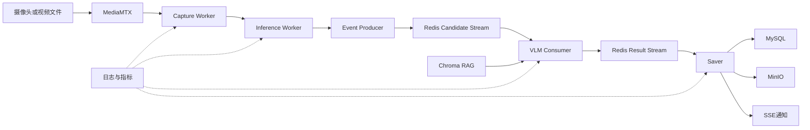
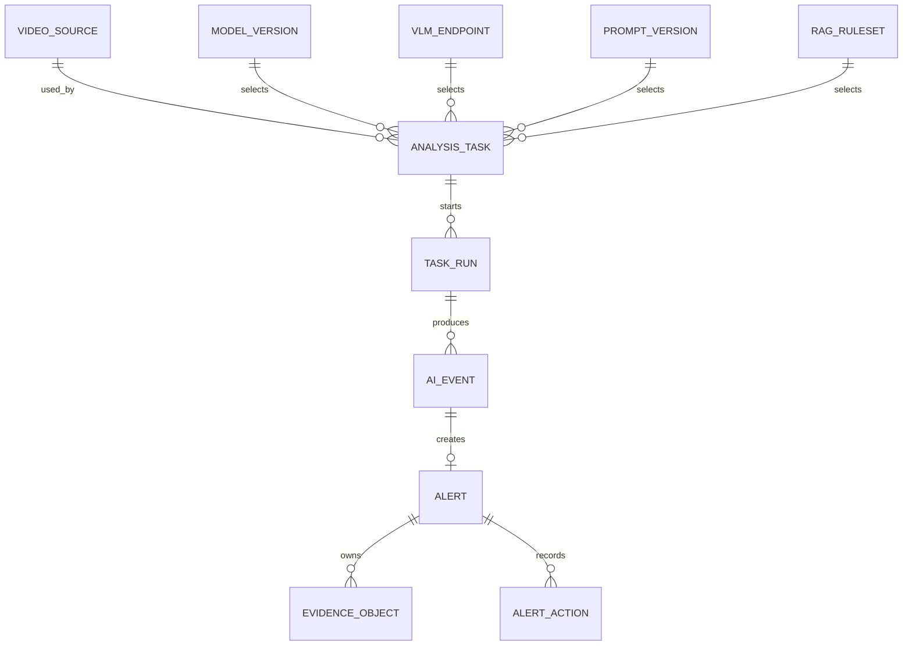

# AI视频数据分析系统选择性对齐设计

## 1. 文档目的

本文档用于统一当前项目与《AI视频数据分析系统说明文档》中相同能力的设计。项目参考成熟系统的业务边界和模块划分，但不直接复制不适合单机开发、RTX 4050资源条件及秋招作品集目标的实现。

本文档是后续实施计划、数据表、Redis消息、API和测试设计的上位依据。正式开发前，应先完成本文档评审，再把工作拆入实施计划。

## 2. 项目定位

项目定位为面向园区、工厂和办公区等场景的轻量级多模态视频理解与智能告警平台。核心价值不是重复训练通用YOLO模型，而是构建可运行、可追溯、可观测的AI工程链路：

1. MediaMTX接入摄像头或本地模拟视频流。
2. YOLO与Tracker完成目标检测、轨迹维护和候选事件筛选。
3. VLM结合多帧图像理解行为和场景。
4. RAG向VLM注入安全规范、业务规则和处置知识。
5. Saver将事件、告警和证据分别保存到MySQL与MinIO。
6. SSE向前端推送实时任务状态和告警。
7. 日志、指标和链路标识记录各阶段耗时与故障。

## 3. 设计原则

- **选择性对齐**：相同业务能力遵循参考系统的成熟边界，不合理的技术细节进行改良。
- **AI主链路优先**：先完成视频接入、YOLO、VLM、RAG、告警和可观测性，再扩展聊天、Agent和开放平台。
- **轻量部署**：使用Flask、Python Worker、MySQL、Redis、MinIO、MediaMTX和Chroma，不引入Kafka、Kubernetes和重型服务治理框架。
- **小消息传递**：Redis只传JSON元数据；图片和视频通过临时文件引用或MinIO对象Key传递。
- **历史可追溯**：告警能够追溯YOLO模型、VLM端点、Prompt和RAG规则版本。
- **实时链路优先时效**：积压时丢弃过期帧，而不是无限追赶历史帧。
- **不夸大AI效果**：没有人工标注集时不宣称Precision、Recall或mAP，只报告工程性能和定性结果。

## 4. 范围分层

### 4.1 首版核心范围

| 能力 | 首版内容 |
|---|---|
| 视频源管理 | 本地视频、RTSP/RTMP/HTTP源、连通性测试、MediaMTX代理路径、状态管理 |
| 分析任务 | 选择视频源、检测模型、VLM端点、Prompt和规则版本，启动、停止与运行记录 |
| YOLO推理 | 行人检测、抽帧、批处理、Tracker、候选事件筛选和性能指标 |
| VLM分析 | 多帧输入、结构化输出、超时、重试、限流、熔断和降级 |
| RAG | Chroma知识库、规则检索、Prompt注入和知识版本 |
| 告警管理 | 确认、驳回、处置、关闭、审计和证据查看 |
| 证据管理 | 截图、告警前后录像、对象Key、完整性校验、删除和保留策略 |
| 实时能力 | MediaMTX拉流与预览、SSE告警通知 |
| 可观测性 | 结构化日志、分阶段耗时、队列积压、错误率、资源指标和健康检查 |
| 安全基础 | 认证、配置脱敏、私有Bucket、短期Presigned URL和输入校验 |

### 4.2 后置范围

- 智能聊天和复杂Agent。
- 企业微信、钉钉和邮件等多渠道推送。
- 第三方Open API及API Key管理。
- 完整多租户和复杂RBAC。
- 浏览器在线上传任意YOLO权重。
- 多GPU、多节点和Kubernetes部署。
- 大规模监控墙和复杂报表。
- Milvus等高并发向量数据库。

后续Agent应围绕事件查询、规范检索、报告生成和经人工确认的操作执行，而不是做与业务无关的通用聊天。

## 5. 总体架构



Web API只承担管理、查询和实时通知，不在HTTP请求进程内执行视频解码、YOLO或VLM等耗时任务。

## 6. 模块职责

### 6.1 Capture Worker

- 从MediaMTX统一RTSP地址拉流。
- 使用OpenCV或FFmpeg解码、抽帧并保留原始时间戳。
- 维护告警录像所需的有界环形缓冲。
- 处理断流、损坏帧和指数退避重连。
- 向推理调度器提交帧，不加载YOLO和调用VLM。

### 6.2 Inference Worker

- 集中加载YOLO，避免每个视频源重复占用模型内存或显存。
- 对多个视频源进行轮询或加权公平调度。
- 执行预处理、批量推理、类别过滤、后处理和Tracker更新。
- 队列积压时丢弃超过时效的旧帧。
- 输出检测结果与轨迹，不直接写告警。

### 6.3 Event Producer

- 合并同一轨迹的重复检测。
- 根据新目标、区域进入、停留、明显变化、定时巡检或音频异常生成候选事件。
- 控制同一目标调用VLM的最短间隔。
- 从连续帧中选择代表性多帧。
- 将小型候选事件JSON写入Redis Stream。

### 6.4 VLM Consumer

- 通过Consumer Group读取候选事件。
- 获取临时帧引用或MinIO对象Key。
- 从Chroma检索相关规则并组装Prompt。
- 调用VLM，校验结构化JSON Schema。
- 处理超时、重试、熔断和备用端点。
- 将结构化结果写入结果Stream，不保存模型隐藏思维链。

### 6.5 Saver

- 校验结果消息并按照`event_id`幂等持久化。
- 判断是否生成告警并执行告警状态初始化。
- 获取环形缓冲片段，生成截图和告警前后录像。
- 上传证据到MinIO并保存`bucket + object_key + sha256`。
- 发布SSE通知。
- 处理存储重试、软删除、清理和一致性修复。

## 7. 核心数据模型

### 7.1 实体关系



### 7.2 `video_source`

关键字段：`id`、`name`、`source_type`、`source_uri`、`mediamtx_path`、`enabled`、`connection_status`、`last_checked_at`、`last_error`、`created_by`、`created_at`、`updated_at`。

验证规则：

- `source_type`限定为`local_file/rtsp/rtmp/http`。
- 本地文件必须位于允许目录内，拒绝路径遍历。
- RTSP凭据不得返回普通前端或写入日志。
- 存在运行任务时禁止删除，只允许先禁用。
- `preview_url`按请求动态生成，不持久化临时URL。

### 7.3 `analysis_task`与`task_run`

`analysis_task`保存可复用配置：视频源、模型版本、VLM端点、Prompt版本、RAG规则集、抽帧率、VLM间隔、Tracker开关和录像前后时长。

任务状态为：

```text
created -> starting -> running -> stopping -> stopped
                    \-> failed
```

`task_run`记录每次实际运行的配置快照、Worker标识、启动停止时间、处理帧数、事件数、告警数、心跳、停止原因和错误摘要。运行中的任务不能直接修改关键配置，需停止后重新启动形成新的运行实例。

### 7.4 版本治理实体

- `model_version`：模型名、版本、框架、权重路径或对象Key、SHA-256、类别映射、输入尺寸、设备策略和启用状态。
- `vlm_endpoint`：提供商、Base URL、模型名、凭据引用、超时、最大并发、健康状态和启用状态。
- `prompt_version`：模板、输入变量、目标JSON Schema、版本和启用状态。
- `rag_ruleset`：规则集版本、Chroma集合、Embedding模型、文档数量、内容摘要和生效时间。

历史已引用版本只允许禁用，不物理删除。告警必须保存实际运行快照，不能只关联可能继续变化的当前配置。

### 7.5 `ai_event`

关键字段：`event_id`、`task_id`、`task_run_id`、`source_timestamp`、`detected_objects`、`track_ids`、`vlm_status`、`vlm_result`、`risk_level`、模型快照、VLM快照、Prompt快照、规则快照和创建时间。

VLM状态为：

```text
pending -> processing -> succeeded
                      \-> retrying -> succeeded
                      \-> failed
                      \-> dead_letter
```

### 7.6 `alert`、`evidence_object`与`alert_action`

告警状态为：

```text
pending -> confirmed -> processing -> resolved
        \-> rejected
```

`alert`保存类型、标题、风险等级、结构化结论、审计摘要、事件ID、状态、责任人和幂等键。

`evidence_object`保存`bucket`、`object_key`、类型、SHA-256、MIME、大小、保留期限和存储状态，不保存Presigned URL。

`alert_action`保存每次人工操作的操作类型、前后状态、操作人、备注和时间，形成完整处置审计链。

## 8. Redis消息设计

### 8.1 Stream与Consumer Group

| Key | Consumer Group | 用途 |
|---|---|---|
| `stream:ai:candidate-events` | `group:vlm-consumers` | YOLO候选事件 |
| `stream:ai:analysis-results` | `group:saver-consumers` | VLM分析结果 |
| `stream:ai:dead-letter` | 管理端读取 | 无法继续处理的消息 |
| `stream:system:notifications` | `group:notification-consumers` | SSE通知 |
| `stream:storage:cleanup` | `group:cleanup-consumers` | 对象删除与清理 |
| `stream:audio:candidate-events` | 后续音频Consumer | 音频候选事件 |

### 8.2 候选事件契约

```json
{
  "schema_version": 1,
  "message_id": "msg_xxx",
  "event_id": "evt_xxx",
  "task_id": 12,
  "task_run_id": 31,
  "source_id": 5,
  "source_timestamp": "2026-07-18T14:30:22.120+08:00",
  "track_ids": [17],
  "object_summary": [
    {
      "class_id": 0,
      "class_name": "person",
      "confidence": 0.89,
      "bbox": [120, 80, 360, 620]
    }
  ],
  "frame_refs": [
    {"frame_index": 1, "temp_ref": "events/evt_xxx/frame_001.jpg"}
  ],
  "attempt": 0,
  "created_at": "2026-07-18T14:30:22.200+08:00",
  "expires_at": "2026-07-18T14:35:22.200+08:00"
}
```

消息必须带`schema_version`，后续字段演进时由Consumer兼容旧版本。Redis中禁止放Base64图片和MP4字节。

### 8.3 VLM结果契约

```json
{
  "schema_version": 1,
  "message_id": "msg_result_xxx",
  "event_id": "evt_xxx",
  "task_run_id": 31,
  "summary": "人员在办公区域内正常行走",
  "behavior": "walking",
  "risk_level": "none",
  "is_alert": false,
  "confidence": 0.87,
  "evidence": [
    {"frame_index": 2, "description": "人员从入口向办公区域移动"}
  ],
  "matched_rules": [],
  "recommended_actions": [],
  "model_snapshot": {},
  "prompt_snapshot": {},
  "ruleset_snapshot": {},
  "created_at": "2026-07-18T14:30:23.500+08:00"
}
```

`confidence`仅表示VLM自报置信程度，不能当作经过标注集验证的准确率。

### 8.4 ACK、重试、死信与幂等

- Consumer处理成功后执行`XACK`。
- Worker异常退出后，通过Pending Entries List和`XAUTOCLAIM`恢复超时消息。
- VLM最多重试2次，Saver最多3次，MinIO删除最多5次，采用指数退避。
- 超过次数或不可恢复错误写入死信Stream，并保留原消息、失败阶段和错误摘要。
- 已超过`expires_at`的实时事件不再调用VLM，记录为过期。
- MySQL为`event_id`建立唯一索引，告警幂等键由`event_id + alert_type`生成。
- 数据库提交成功但ACK失败时，重复消费不得生成重复记录。

### 8.5 背压

- Capture降低抽帧率。
- Inference丢弃超过时效的旧帧。
- Producer合并同一轨迹的重复事件。
- 低风险巡检事件允许采样，高风险规则事件优先。
- Dashboard展示Stream长度、Pending数量和最旧消息等待时间。

## 9. MediaMTX、FFmpeg与预览边界

MediaMTX负责接收或代理RTSP/RTMP流、统一内部拉流地址、共享单路视频源并为浏览器提供HLS或WebRTC能力。MediaMTX不承担AI推理和长期文件存储。

FFmpeg用于本地MP4按真实帧率推流、裁剪测试视频、转码、抽帧、音轨提取和生成告警短视频。测试链路为：

```text
本地MP4 -> FFmpeg -> MediaMTX -> Capture -> YOLO -> VLM -> Saver
```

Worker内部分析优先RTSP；浏览器首版优先HLS，低延迟场景后续启用WebRTC。MJPEG只作为调试或降级方式，因为其带宽高、无音频且多用户长连接扩展性较差。

## 10. MinIO设计

### 10.1 Bucket与Key

| Bucket | 内容 |
|---|---|
| `video-source` | 用户上传的离线视频 |
| `event-snapshots` | AI事件截图 |
| `alert-clips` | 告警前后录像 |
| `rag-documents` | RAG原始知识文档 |
| `model-artifacts` | 模型文件和版本产物 |
| `temporary` | 有生命周期的临时对象 |

Key规范示例：

```text
event-snapshots/{source_id}/{yyyy}/{mm}/{dd}/{event_id}/frame_001.jpg
alert-clips/{source_id}/{yyyy}/{mm}/{dd}/{alert_id}/clip.mp4
video-source/{owner_id}/{upload_id}/{safe_filename}
rag-documents/{ruleset_id}/{document_id}/{version}/{safe_filename}
model-artifacts/{model_name}/{version}/{sha256}/{filename}
```

对象Key不得包含密码、Token或摄像头地址，不直接使用未经处理的原始文件名。

### 10.2 Multipart断点续传

离线大视频采用业务级上传会话：创建`upload_id`、记录分片编号与ETag、查询已完成分片、补传缺失分片、校验大小和SHA-256、完成Multipart。超时会话由Cleaner中止。实时视频流不先上传MinIO。

### 10.3 删除与一致性

```text
删除请求 -> MySQL标记deleting -> 写入cleanup Stream
         -> Cleaner删除MinIO对象 -> MySQL标记deleted
```

删除失败自动重试，超过次数进入死信。定期扫描孤儿对象和失联记录。MySQL和MinIO之间采用最终一致性，不实现伪分布式事务。

### 10.4 安全

- Bucket默认私有。
- 使用独立服务账号和最小权限。
- 生产环境使用TLS。
- 支持SSE-S3或SSE-KMS服务端加密。
- Presigned URL按访问请求短期签发。
- 下载前校验用户与业务对象权限。

## 11. RAG与VLM治理

RAG用于注入企业安全规范、行为定义、告警等级和处置流程，不用于泛化百科问答。检索流程为“检测摘要与场景信息 -> Chroma检索 -> 元数据过滤 -> Top-K规则 -> Prompt注入 -> VLM结构化判断”。

每次知识更新生成新规则集版本，记录文档版本、分块策略、Embedding模型、集合名称、内容摘要和生效时间。历史告警保留当时检索到的文档ID及规则版本。

VLM端点提供统一适配接口，并具有：

- 最大并发和速率限制。
- 请求超时和有限重试。
- 连续失败熔断与半开探测。
- 主端点失败后的备用端点。
- 全端点不可用时的待补偿状态。
- 过期实时事件停止补偿，避免无限积压。

## 12. 音频扩展

音频作为后续独立阶段：FFmpeg提取音轨，VAD检测人声，ASR生成文本，音频分类识别尖叫、撞击或玻璃破碎等异常。音频事件可触发相同时间窗口的视频多帧VLM分析。

首版融合采用规则和VLM二次判断，不训练新的多模态融合模型。统一事件可包含视觉摘要、VLM结论、ASR文本、音频类别、时间窗口、命中规则和综合风险等级。

## 13. API边界

### 13.1 视频源

- `POST /api/video-sources`
- `GET /api/video-sources`
- `GET /api/video-sources/{id}`
- `PUT /api/video-sources/{id}`
- `DELETE /api/video-sources/{id}`
- `POST /api/video-sources/{id}/test`
- `GET /api/video-sources/{id}/preview`

### 13.2 分析任务

- `POST /api/analysis-tasks`
- `GET /api/analysis-tasks`
- `GET /api/analysis-tasks/{id}`
- `PUT /api/analysis-tasks/{id}`
- `POST /api/analysis-tasks/{id}/start`
- `POST /api/analysis-tasks/{id}/stop`
- `GET /api/analysis-tasks/{id}/metrics`

### 13.3 模型、VLM与RAG

- `GET /api/models`
- `POST /api/models/register`
- `POST /api/models/{id}/verify`
- `GET /api/vlm-endpoints`
- `POST /api/vlm-endpoints`
- `POST /api/vlm-endpoints/{id}/test`
- `POST /api/rag/rulesets`
- `POST /api/rag/rulesets/{id}/documents`
- `POST /api/rag/rulesets/{id}/rebuild`
- `POST /api/rag/rulesets/{id}/search`
- `GET /api/rag/rulesets/{id}/versions`

### 13.4 告警与文件

- `GET /api/alerts`
- `GET /api/alerts/{id}`
- `POST /api/alerts/{id}/confirm`
- `POST /api/alerts/{id}/reject`
- `POST /api/alerts/{id}/process`
- `POST /api/alerts/{id}/resolve`
- `GET /api/alerts/{id}/evidence/{evidence_id}`
- `GET /api/events/stream`
- `POST /api/uploads/multipart`
- `GET /api/uploads/{upload_id}`
- `POST /api/uploads/{upload_id}/parts/{part_number}`
- `POST /api/uploads/{upload_id}/complete`
- `DELETE /api/uploads/{upload_id}`

统一成功响应包含`success`、`data`和`request_id`；错误响应包含稳定的`error.code`、用户可读`message`和`request_id`。接口应校验字段类型、枚举、长度、状态前置条件和资源权限。

## 14. 可观测性

所有阶段统一记录`request_id`、`trace_id`、`event_id`、`task_id`和`task_run_id`。

重点指标：

- 采集：拉流成功率、断流次数、重连次数、解码FPS、丢帧数和最新帧延迟。
- YOLO：预处理、推理、后处理、实际FPS、模型加载和资源占用。
- VLM：请求量、成功率、超时率、重试、P50/P95/P99、图片数、Token和JSON解析失败率。
- Redis：Stream长度、Pending数量、最旧消息时间、重试和死信。
- MinIO：上传成功率、延迟、删除失败、孤儿对象和容量。
- 端到端：视频时间戳到YOLO完成、VLM完成、告警入库和SSE送达的阶段耗时。

日志使用JSON结构，禁止记录密码、Token、完整Presigned URL和图片字节。Prompt默认只记录版本及摘要。

## 15. 异常与降级

| 异常 | 处理 |
|---|---|
| 视频断流 | 指数退避重连并将任务标记为降级 |
| 视频长期不可用 | 任务失败并通知前端 |
| YOLO加载失败 | 禁止任务启动并返回明确错误 |
| GPU不可用 | 按设备策略回退CPU或终止启动 |
| 推理速度不足 | 降低抽帧、缩小输入、批处理或丢旧帧 |
| Redis暂不可用 | 使用有界本地缓冲，超限丢弃过期实时事件 |
| VLM超时 | 重试、熔断、切换备用端点或标记待补偿 |
| VLM非法JSON | 尝试一次受约束修复，仍失败则进入重试 |
| Chroma不可用 | 使用基础Prompt继续并标记未使用RAG |
| MySQL失败 | Saver不ACK，等待重新消费 |
| MinIO上传失败 | 事件先入库，证据标记失败并异步重试 |
| SSE断开 | 前端自动重连并使用事件ID恢复 |
| 录像失败 | 保留截图和告警，标记证据不完整 |

## 16. 安全边界

- 密码哈希、登录失败限制和Session或JWT认证。
- 接口权限校验、CORS白名单和审计记录。
- 上传扩展名、MIME、文件大小和视频解码验证。
- 防路径遍历、SQL注入和XSS。
- Redis、MySQL和MinIO不暴露到非必要公网。
- RTSP凭据、MinIO密钥和VLM密钥使用环境变量或密钥引用。
- 表结构保留`owner_id`或`created_by`，但首版不实现复杂多租户。

## 17. 测试策略

### 17.1 单元测试

覆盖状态机、候选事件筛选、消息序列化、VLM Schema、对象Key、幂等键、RAG组装和YOLO结果转换。

### 17.2 集成测试

覆盖MySQL CRUD，Redis Streams的ACK、Claim和死信，MinIO上传下载删除和Multipart，MediaMTX推拉流与断流重连，Chroma写入检索，以及VLM超时和错误响应。

### 17.3 全链路测试

```text
本地MP4 -> FFmpeg -> MediaMTX -> Capture -> YOLO -> Redis
        -> 模拟或真实VLM -> Saver -> MySQL/MinIO -> SSE
```

### 17.4 性能测试

测试YOLO延迟与FPS、多源调度、VLM并发、Redis积压恢复、端到端P50/P95/P99，以及CPU、内存和显存峰值。

### 17.5 异常与攻击测试

覆盖非法视频源、路径遍历、超大文件、伪造MIME、XSS、SQL注入、重复消息、Redis/MySQL/MinIO断连、VLM超时与非法JSON、视频损坏帧、未授权证据访问和Presigned URL过期。

没有人工标注时不进行Precision、Recall和mAP声明。工程验收重点是吞吐、稳定性、时延、结构化输出成功率、规则命中一致性和可解释性。

## 18. 分阶段实施顺序

1. **基础设施与项目骨架**：维护现有Redis、MySQL、MinIO、MediaMTX、Flask、健康检查、视频链路和YOLO CPU基线。
2. **视频源与任务模型**：新增`video_source`、`task_run`、状态机、连通性测试、代理路径和心跳。
3. **集中式YOLO与Tracker**：实现Capture、Inference、集中模型加载、Tracker、候选筛选、背压和多源调度。
4. **Redis可靠事件链路**：实现消息契约、Consumer Group、ACK、重试、死信、Pending恢复和幂等。
5. **VLM结构化分析**：实现端点抽象、多帧输入、JSON Schema、超时、熔断、健康检查和模拟测试。
6. **RAG规则知识库**：实现文档解析、分块、Embedding、规则版本、检索接口和Prompt注入。
7. **Saver与告警闭环**：实现事件、告警状态机、人工处置、截图录像、SSE和版本追溯。
8. **MinIO完整能力**：实现单删、批删、Cleaner、孤儿扫描、Multipart、校验、TLS和加密。
9. **可观测性与性能优化**：实现结构化日志、Trace、指标、FP16、ONNX Runtime、动态抽帧和批处理对比。
10. **音频模态**：实现音轨提取、VAD、ASR、声音分类、时间对齐和事件融合。
11. **Agent与产品化**：实现事件查询、规范检索、报告生成、人工确认动作和基础开放能力。

每个阶段都应先形成可测试的最小闭环，再进入下一阶段；不得为了追求功能数量跳过可靠性和测试。

## 19. 与参考系统的最终对齐矩阵

### 19.1 保持一致

- Flask、MySQL、Redis、MinIO和MediaMTX技术主干。
- 视频源、任务、Producer/Consumer/Saver职责划分。
- YOLO、Tracker、VLM、RAG和时序分析。
- 告警录像、SSE、实时预览和可观测性。

### 19.2 改良后采用

- Redis改为Streams、ACK和小型JSON，不传Base64图片或MP4。
- YOLO集中加载，不按视频源重复加载模型。
- 使用结果Stream关联事件，不由Producer轮询VLM。
- MySQL保存对象Key，不持久化会过期的Presigned URL。
- 保存结构化结论和审计摘要，不保存隐藏思维链。
- 增加模型、Prompt、规则版本和告警人工处置闭环。

### 19.3 后置实现

- 智能聊天、复杂Agent、Open API、完整RBAC、多渠道通知、在线任意模型上传和大规模监控墙。

## 20. 设计验收标准

- 相同业务能力与参考系统模块边界一致，差异均有明确工程理由。
- 数据模型支持视频源复用、运行快照和历史版本追溯。
- Redis契约定义消息版本、ACK、重试、死信、过期与幂等。
- MediaMTX、MinIO、MySQL和Redis职责无重叠或大文件误用。
- RTX 4050单机场景下不重复加载YOLO，具备背压和降级方案。
- 告警具有证据、状态机、人工处置和审计闭环。
- API、字段验证、保留规则、错误场景和测试边界已明确。
- 后续实施计划必须引用本设计并按阶段拆分，不得未经评审扩大首版范围。
