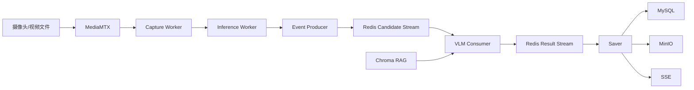

# AI视频智能分析系统实施计划

> 更新日期：2026-07-19
> 当前状态：阶段1、阶段2切片A、B、C、D已完成“集中式Inference Worker与YOLO检测画面”已完成；下一步是轻量Tracker与轨迹可视化。
> 当前自动化基线：全量202 passed, 13 warnings；切片C专项28 passed。（`181 passed, 13 warnings`；切片B专项`37 passed`。

## 1. 文档定位

本文维护项目级路线、阶段依赖、范围和验收口径，不重复维护容易过期的逐函数施工步骤。正式开发同时阅读：

1. [选择性对齐设计](superpowers/specs/2026-07-18-参考系统选择性对齐设计.md)：上位架构和业务边界。
2. [总实施路线图](superpowers/plans/2026-07-18-AI视频分析系统总实施路线图.md)：全部阶段、依赖和门禁。
3. [集中式YOLO与Tracker实施计划](superpowers/plans/2026-07-19-集中式YOLO与Tracker实施计划.md)：当前阶段的纵向切片、接口、页面、TDD步骤和测试命令。
4. [模块开发详解](模块开发详解.md)：模块作用、开发方式和技术取舍。
5. [项目知识手册](项目知识手册.md)：基础知识、原理、排障和面试解释。

出现冲突时，优先级为：已审核设计 > 当前阶段详细计划 > 本文 > 旧测试报告。完成状态始终以代码和最新测试证据为准。

## 2. 项目目标

面向园区、工厂和办公区构建轻量级多模态视频理解与告警平台。重点不是重新训练成熟的通用检测模型，而是完成可运行、可追溯、可观测、可降级的AI工程链路：

- MediaMTX统一接入本地视频、摄像头和网络流。
- YOLO与Tracker进行高频目标检测、轨迹维护和候选筛选。
- VLM对少量代表性多帧理解人员行为和场景。
- RAG把安全规范、业务规则和处置知识注入VLM。
- Redis Streams可靠连接异步Worker。
- MySQL保存任务、事件、告警、版本和审计事实。
- MinIO保存截图、录像、音频和规则原文。
- SSE、日志和指标提供告警通知与全链路可观测性。

## 3. 统一架构

### 3.1 职责边界

| 模块 | 负责 | 不负责 |
|---|---|---|
| Flask | 管理API、查询、页面、SSE | 在HTTP线程长期拉流或推理 |
| MediaMTX | 协议接入、代理和多协议分发 | 保存业务证据、执行AI |
| Capture Worker | 拉流、解码、抽帧、时间戳、环形缓冲 | 加载YOLO、调用VLM |
| Inference Worker | 集中加载YOLO、多源调度、Tracker | 直接生成最终告警 |
| Event Producer | 轨迹去重、触发策略、多帧选择 | 轮询等待VLM结果 |
| VLM Consumer | RAG检索、Prompt、VLM、Schema校验 | 保存隐藏思维链 |
| Saver | 幂等落库、证据上传、告警初始化、通知 | 重新执行检测和推理 |

### 3.2 媒体流向

- FFmpeg把本地MP4模拟为实时流并发布到MediaMTX的RTSP路径。
- MediaMTX负责正在传输的媒体，不是对象存储。
- Worker从MediaMTX拉RTSP并解码，YOLO处理抽样帧。
- 只有候选事件的代表帧/片段交给VLM，不是每帧都调用大模型。
- 只有长期保存的告警证据上传MinIO；普通实时帧不进入MinIO。
- 浏览器实时预览优先WebRTC，兼容预览可用HLS；MJPEG只用于调试。

## 4. 技术栈与约束

| 领域 | 选型 | 原因 |
|---|---|---|
| Web | Flask + Jinja2 + SSE | 轻量、便于单机开发和解释 |
| 数据库 | MySQL 8.4 + SQLAlchemy + Alembic | 事务、关系、迁移和审计能力 |
| 消息 | Redis 7 Streams + Consumer Group | 单机成本低，同时具备ACK/Pending/Claim |
| 对象存储 | MinIO | S3兼容，适合证据和大文件 |
| 流媒体 | MediaMTX + FFmpeg/OpenCV | 统一RTSP/HLS/WebRTC和解码工具链 |
| 检测 | Ultralytics YOLO + Tracker | 复用预训练模型，重点做工程链路 |
| 语义 | OpenAI兼容VLM API | 云端/本地端点可替换 |
| 向量库 | Chroma | 单机嵌入式，适合当前文档规模 |
| 可观测性 | structlog + Prometheus | 结构化上下文和量化指标 |

全局约束：

- 不引入Kafka、Celery、Kubernetes和Milvus等当前不需要的重组件。
- Redis只传小型JSON；媒体内容使用受控临时引用或MinIO Key。
- Presigned URL按请求生成，数据库不保存临时URL。
- 历史告警必须追溯YOLO、VLM、Prompt和RAG版本快照。
- GPU恢复前使用CPU和YOLOv8n联调，不伪造CUDA/FP16结果。
- 无人工标注时不宣称Recall、Precision或mAP。

## 5. 当前真实状态

| 能力 | 状态 | 证据或限制 |
|---|---|---|
| Redis/MySQL/MinIO/MediaMTX | 已实现 | Docker容器和协议健康检查完成 |
| Flask基础API与页面 | 已实现 | 任务、告警、健康、指标原型可用 |
| MySQL基础模型 | 已实现 | 当前仍由`db.create_all()`管理，迁移框架待引入 |
| Redis基础封装 | 原型 | List、缓存、Pub/Sub已测；正式事件链路迁移Streams |
| MinIO基础封装 | 原型 | 上传、下载、签名URL已具备；删除、Multipart和Cleaner待开发 |
| MediaMTX链路 | 部分实现 | RTSP发布/拉流、OpenCV取帧、HLS解码已测 |
| YOLO行人检测 | 已实现 | v8n/v8s CPU工程基准和抽样定性检查完成 |
| 独立视频源和TaskRun | 已实现 | `VideoSource`、`AnalysisTask`、`TaskRun`、状态机、配置快照和迁移已完成 |
| Capture与Inference Worker | 已实现 | 本地文件/RTSP采集、最新帧背压、共享YOLO、公平轮询、状态API和检测预览已完成 |
| Tracker、ROI与候选触发 | 已实现 | 阶段二全链路已验证通过 | 尚无稳定`track_id`、轨迹去重和VLM候选事件 |
| Redis Streams | 待开发 | 尚无ACK、Pending、Claim和死信 |
| VLM/RAG/Saver | 待开发 | 尚无端到端告警闭环 |
| 音频/Agent | 后置 | 视频主链路稳定后再开发 |

## 6. 开发阶段

### 阶段0：基础设施与骨架【已完成】

- 四个Docker服务、配置管理、ORM/API原型、日志和Prometheus。
- 本地视频裁剪、RTSP发布/拉流、HLS和OpenCV取帧验证。
- YOLOv8n/v8s CPU工程性能基准。
- 阶段0完成时基线为`66 passed, 12 warnings`；当前全量基线已提升为`181 passed, 13 warnings`。

### 阶段1：视频源与任务模型【已完成】

- 引入Flask-Migrate/Alembic，停止应用启动时隐式改表。
- 新增`VideoSource`、`TaskRun`和任务状态机。
- 增加视频源CRUD、FFprobe连通性测试、任务启动/停止和运行历史API。
- 兼容旧`/api/tasks`，迁移旧`source_url`数据。
- 测试路径遍历、命令注入、RTSP凭据脱敏、重复启动和迁移回滚。

阶段完成后拥有可靠控制面；没有Worker心跳时任务只能是`starting`，不能显示为`running`。

### 阶段2：集中式YOLO与Tracker

- Capture Worker负责拉流、时间戳、重连、有界缓冲和资源释放。【切片A已完成】
- Runtime状态API、MJPEG调试预览和实时处理页面。【切片A已完成】
- Inference Worker集中加载YOLO并进行多源公平调度，输出检测MJPEG与分阶段指标。【切片B已完成】
- 接入Tracker、轨迹去重、ROI和候选触发。
- 背压时丢弃过期帧，优先实时性而不是无限追赶。

### 阶段3：Redis可靠事件链路

- 使用`XADD/XREADGROUP/XACK`替换正式链路中的List。
- 实现Pending检查、`XAUTOCLAIM`、有限重试、死信和消费者崩溃恢复。
- 消息携带`event_id/trace_id/task_id/run_id/schema_version`。
- 数据库唯一约束和幂等键保证重复投递不重复落库。

### 阶段4：VLM结构化分析

- 多帧输入、Prompt版本、JSON Schema校验和原始响应摘要。
- 超时、退避重试、最大并发、限流、熔断和备用端点。
- 不保存模型隐藏思维链。

### 阶段5：RAG规则知识库

- PDF/Markdown入库、分块、Embedding、Chroma集合和规则版本。
- 按场景和候选事件检索，向Prompt注入可引用规则。
- 小型检索评测集测Hit@K和规则引用正确性。

### 阶段6：Saver与告警闭环

- `AIEvent -> Alert -> EvidenceObject -> AlertAction`完整模型。
- Saver按`event_id`幂等落库，生成截图和告警前后录像。
- 证据上传MinIO，MySQL保存Key、SHA-256和状态。
- 人工确认、驳回、处置和关闭均保留审计记录。

### 阶段7：MinIO完整能力

- 单个/批量删除、软删除、重试、Cleaner和孤儿对象扫描。
- 离线大视频Multipart会话、分片ETag、断点恢复、完成与中止。
- 私有Bucket、短期Presigned URL、TLS和服务端加密配置。

### 阶段8：可观测性与性能优化

- 统一`trace_id`，记录解码、排队、YOLO、VLM、保存和端到端耗时。
- 指标覆盖FPS、P50/P95/P99、队列积压、错误率、丢帧率和资源。
- GPU恢复后对比PyTorch FP32/FP16、ONNX Runtime和批处理策略。

### 阶段9：音频模态

- FFmpeg抽取音轨，VAD/声音事件模型先初筛，再选择性调用音频VLM。
- AudioEvent关联TaskRun和时间窗，无音频流时降级为纯视频。
- 与视频事件按时间窗口融合，不把音频逻辑塞入Capture或YOLO模块。

### 阶段10：Agent与产品化

- Agent只做事件查询、规则检索、报告生成和人工确认后的操作。
- 增加认证、授权、审计、限流、CORS白名单和部署配置。
- 多租户、Milvus、多GPU和Kubernetes依据真实容量再评估。

## 7. 测试与验收

每阶段至少包含：正常主流程；服务断开、超时和损坏输入；空值、最大长度和重复请求；SQL注入、XSS、路径遍历、命令注入、SSRF和凭据泄漏；重复启动、并发消费与上传；API和AI链路P50/P95/P99；Worker崩溃、Pending恢复、存储重试和数据库回滚。

完成定义不是“能启动”，而是代码、自动化测试、真实协议验证、文档和已知限制五项齐全。

## 8. 近期执行顺序

1. 按[集中式YOLO与Tracker实施计划](superpowers/plans/2026-07-19-集中式YOLO与Tracker实施计划.md)开发切片B。
2. 集中加载`model_weights/yolov8n.pt`，公平消费各任务最新帧并记录分阶段耗时。
3. 为检测结果补状态接口、带框MJPEG预览和页面指标卡。
4. 先跑专项测试和本地MP4冒烟，再跑全量回归。
5. 完成切片B后立即更新模块开发详解和项目知识手册，不提前混入Tracker、VLM、音频和Agent。

## 9. 面试主线

- 为什么是YOLO筛选 + VLM理解，而不是每帧调用VLM。
- 为什么MediaMTX负责流、MinIO负责对象、MySQL负责关系、Redis负责短期消息。
- 为什么从Redis List升级到Streams，以及ACK、Pending、Claim和幂等如何配合。
- 如何用TaskRun和版本快照让一次告警可复现、可审计。
- 如何在单机4050资源下做集中模型加载、背压、降级和性能测量。
- 如何诚实区分工程性能、定性结果和需要标注集的模型精度指标。
